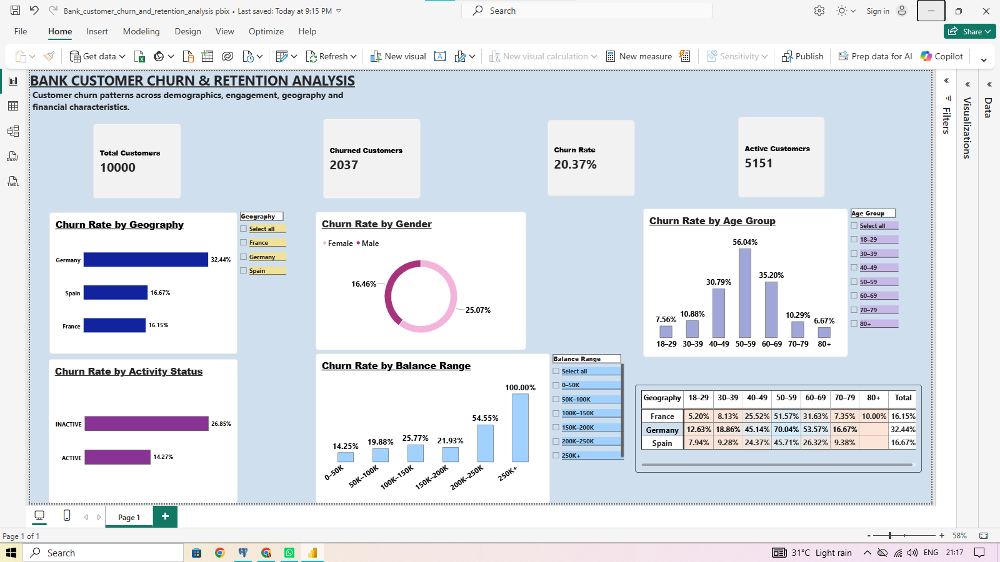

Bank Customer Churn & Retention Analysis

#  Project Overview

This project analyzes customer churn patterns for a bank using SQL and Power BI.
The objective was to identify customer segments with higher observed churn rates and understand how factors such as geography, age, activity status, gender, balance, and customer characteristics are associated with customer churn.
The analysis was performed using SQL for data exploration and business analysis, followed by an interactive Power BI dashboard for visualization. 

#  Business Objectives

The analysis focuses on questions such as:
What is the overall customer churn rate?
Which countries have the highest churn rates?
How does churn vary across different age groups?
Are inactive customers more likely to churn?
How does churn vary by gender?
Is customer balance associated with churn?
How do the number of products and credit card ownership relate to churn?
Which combinations of geography and age show particularly high churn rates?

#  Tools & Technologies 

- **PostgreSQL** — Data validation, cleaning checks and analysis
- **SQL** — Aggregations, filtering, CASE WHEN, conditional calculations and segmentation
- **Power BI** — Interactive dashboard and data visualization
- **DAX** — Measures and calculated columns
- **GitHub** — Project documentation and version control

### Overall Customer Base

- Total customers: **10,000**
- Churned customers: **2,037**
- Overall churn rate: **20.37%**
- Active customers: **5,151**
- Active customer rate: **51.51%**

### Geography

- Germany had the highest observed churn rate: **32.44%**
- Spain: **16.67%**
- France: **16.15%**

### Age

- 50–59: **56.04%**
- 60–69: **35.20%**
- 40–49: **30.78%**
- 30–39: **10.88%**
- 18–29: **7.55%**

### Customer Activity

- Inactive customers: **26.85%**
- Active customers: **14.26%**

### Gender

- Female: **25.07%**
- Male: **16.45%**

### Balance

- 200K–250K: **54.54%**
- 250K+: **100%**
- Higher-balance segments generally showed higher observed churn rates.
- Very high churn rates in smaller segments should be interpreted alongside the number of customers in those segments.

### Deeper Segment Analysis

- Germany, age 50–59: approximately **70%** churn
- Germany, age 60–69: approximately **54%** churn
- France, age 50–59: approximately **52%** churn
  
#  Power BI Dashboard

The dashboard includes:

- KPI cards for total customers, churned customers, churn rate and active customers
- Churn by geography
- Churn by gender
- Churn by age group
- Churn by activity status
- Churn by balance range
- Geography × Age Group churn matrix
- Interactive slicers for geography, age group and balance range

# Dashboard Preview

# DAX Measures

Some of the key DAX measures used in the dashboard include:

Total Customers =
DISTINCTCOUNT(Bank_Churn[customer_id])

Churned Customers =
CALCULATE(
    DISTINCTCOUNT(Bank_Churn[customer_id]),
    Bank_Churn[exited] = 1
)

Churn Rate =
DIVIDE(
    [Churned Customers],
    [Total Customers]
)

Active Customers =
CALCULATE(
    [Total Customers],
    Bank_Churn[is_active_member] = 1
)

#  Project Files

| File | Description |
|------|-------------|
| `Bank_Churn.csv` | Dataset used for the analysis |
| `Bank_customer_churn_and_retention_analysis.sql` | SQL analysis and business queries |
| `Bank_customer_churn_and_retention_analysis.pbix` | Power BI dashboard |
| `power bi dashboard 2.png` | Dashboard preview |
| `README.md` | Project documentation |

#  Key Takeaway

The analysis shows that customer churn is particularly concentrated among certain geographic, demographic and engagement segments. Germany, customers aged 50–59, and inactive customers showed notably higher observed churn rates.

The project demonstrates an end-to-end analytical workflow:

Data validation → SQL analysis → Business insights → DAX → Power BI dashboard
